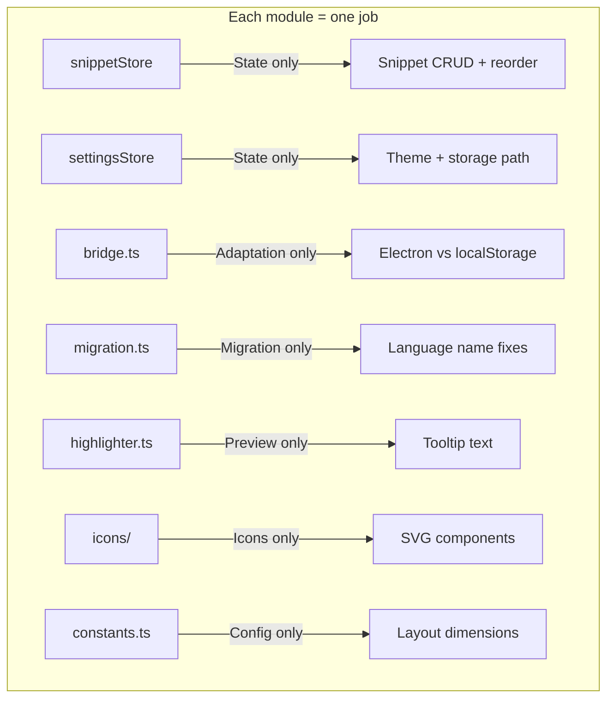
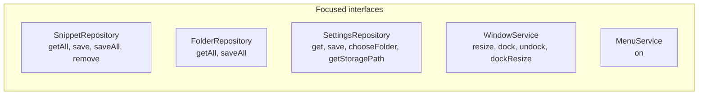
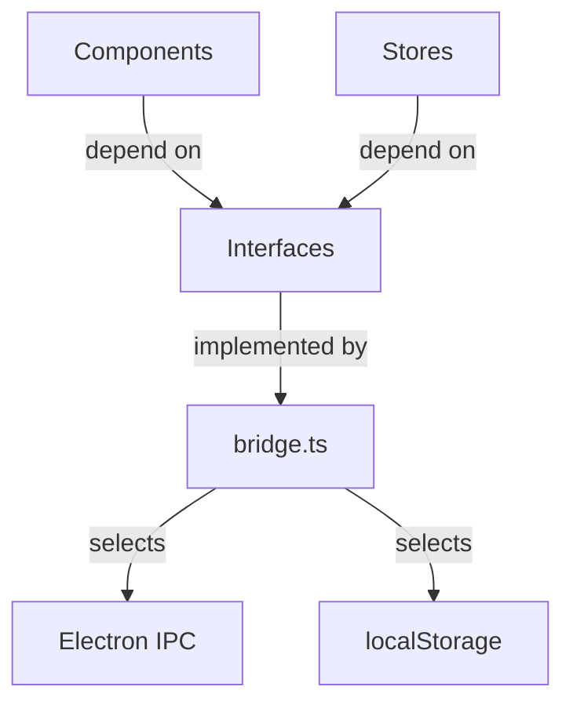
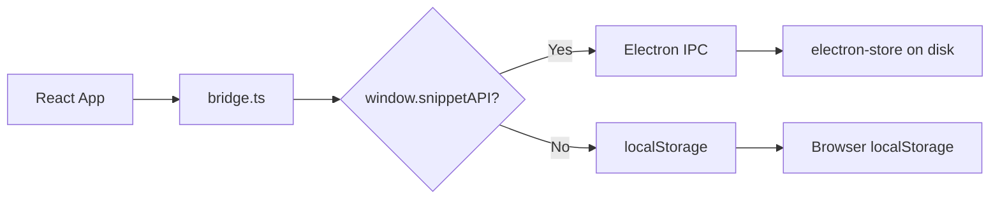
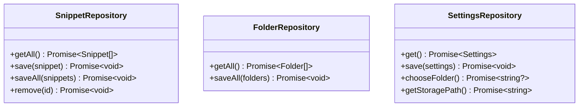
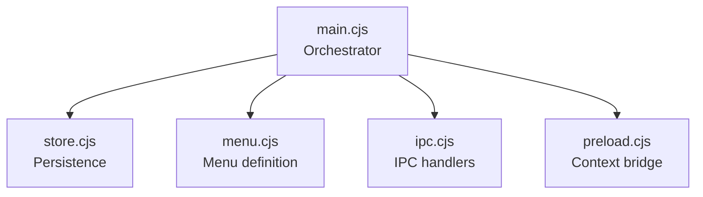
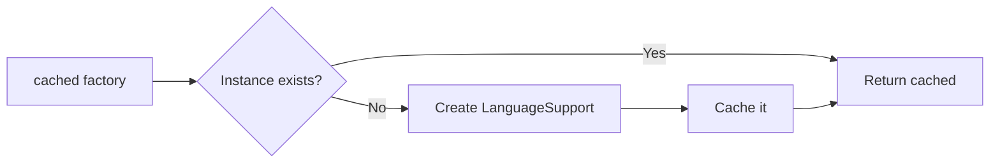

# Architecture & Design Patterns — Snippet Manager

## Design Principles

### SOLID

#### Single Responsibility (SRP)



#### Interface Segregation (ISP)



#### Dependency Inversion (DIP)



### DRY

| What | Solution |
|------|----------|
| Default snippets | Single `data/defaults.json` consumed by both Electron and renderer |
| Language dropdown | Shared `LanguageSelect` component |
| Language factories | `cached()` helper in languages.ts |
| SVG icons | Shared `icons/index.tsx` with `ICON_PATHS` constants |
| Layout dimensions | Shared `constants.ts` |
| localStorage helpers | `localJsonStore()` factory in bridge.ts |

## Design Patterns

### Adapter Pattern — bridge.ts



### Repository Pattern



### Facade Pattern — Electron Main Process



### Factory Pattern — languages.ts



## State Management

```mermaid
graph TD
    subgraph snippetStore
        S1[snippets: Snippet[]]
        S2[folders: Folder[]]
        S3[selectedId: string?]
        S4[search: string]
    end
    subgraph settingsStore
        T1[theme: dark/light]
        T2[storagePath: string]
    end
    subgraph "Granular Selectors"
        C1[Sidebar] -->|s.snippets| S1
        C1 -->|s.folders| S2
        C1 -->|s.selectedId| S3
        C1 -->|s.search| S4
        C2[Editor] -->|s.selectedId| S3
        C2 -->|s.snippets.find| S1
        C3[App] -->|s.theme| T1
    end
```

## Performance Optimizations

| Optimization | Technique |
|-------------|-----------|
| Cached language instances | `cached()` creates LanguageSupport once per language |
| Granular Zustand selectors | Components subscribe to individual slices |
| `key` prop on CodeMirror | Clean mount/unmount when switching snippets |
| `useMemo` for extensions | Only recreated when language changes |
| `useCallback` for handlers | Stable references prevent child re-renders |
| Truncated tooltip preview | Only first 500 chars rendered |

## Project Structure

```
src/
├── components/
│   ├── icons/
│   │   └── index.tsx          ← Shared SVG icon components
│   ├── AddSnippetForm.tsx     ← New snippet form
│   ├── CodeTooltip.tsx        ← Hover preview
│   ├── Editor.tsx             ← CodeMirror editor
│   ├── LanguageSelect.tsx     ← Language dropdown
│   └── Sidebar.tsx            ← Snippet list, folders, dock modes
├── data/
│   ├── defaults.json          ← Default snippets (single source of truth)
│   └── defaults.ts            ← Factory function
├── hooks/
│   └── useMenuEvents.ts       ← Menu event subscriptions
├── services/
│   ├── bridge.ts              ← Adapter: Electron/browser
│   ├── highlighter.ts         ← Tooltip text preview
│   └── migration.ts           ← Data migration
├── store/
│   ├── settingsStore.ts       ← Theme + storage path
│   └── snippetStore.ts        ← Snippet + folder CRUD
├── types/
│   └── snippet.ts             ← All interfaces
├── constants.ts               ← Layout dimensions
├── languages.ts               ← Language registry (10 languages)
├── App.tsx                    ← Root component
├── App.css                    ← Styles (CSS variables)
├── index.css                  ← Global reset
└── main.tsx                   ← Entry point

electron/
├── main.cjs                   ← App lifecycle
├── store.cjs                  ← Persistence
├── menu.cjs                   ← Menu definition
├── ipc.cjs                    ← IPC handlers
└── preload.cjs                ← Context bridge
```
