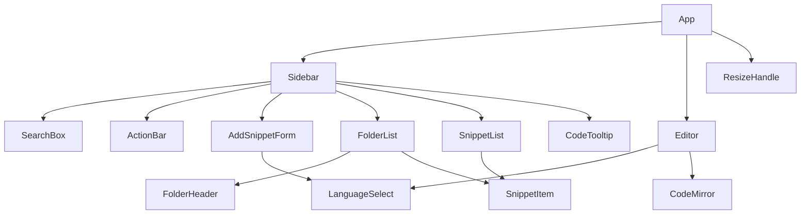
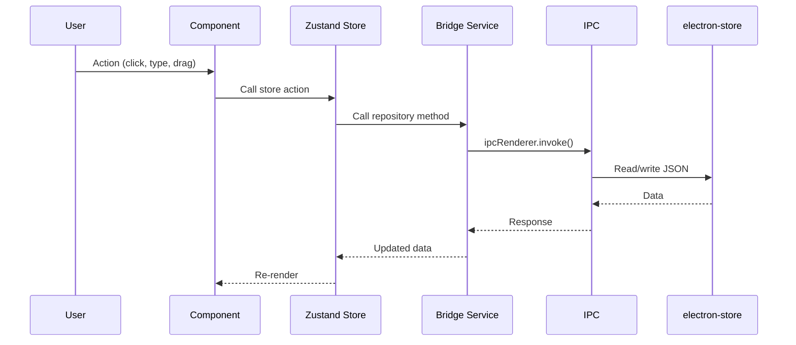
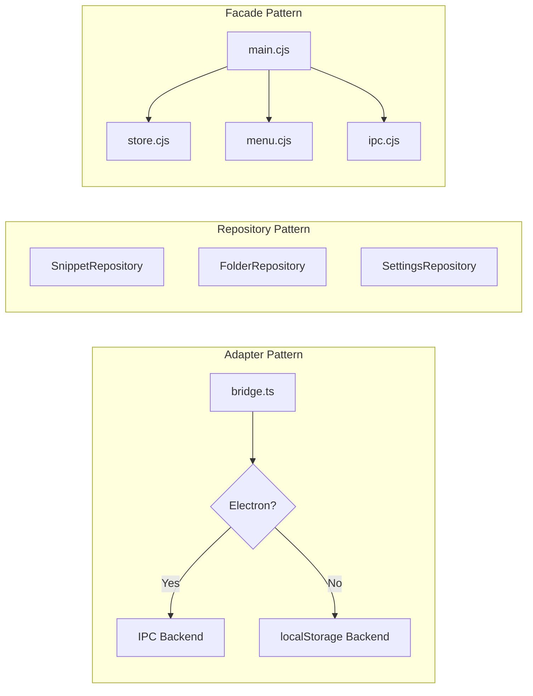
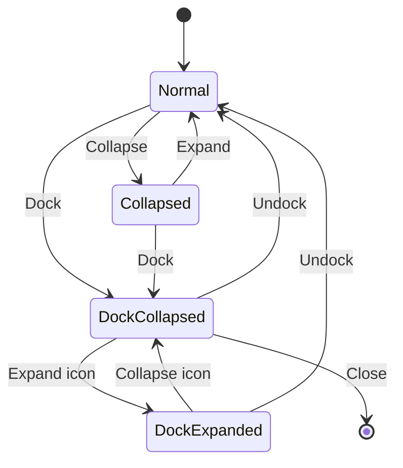
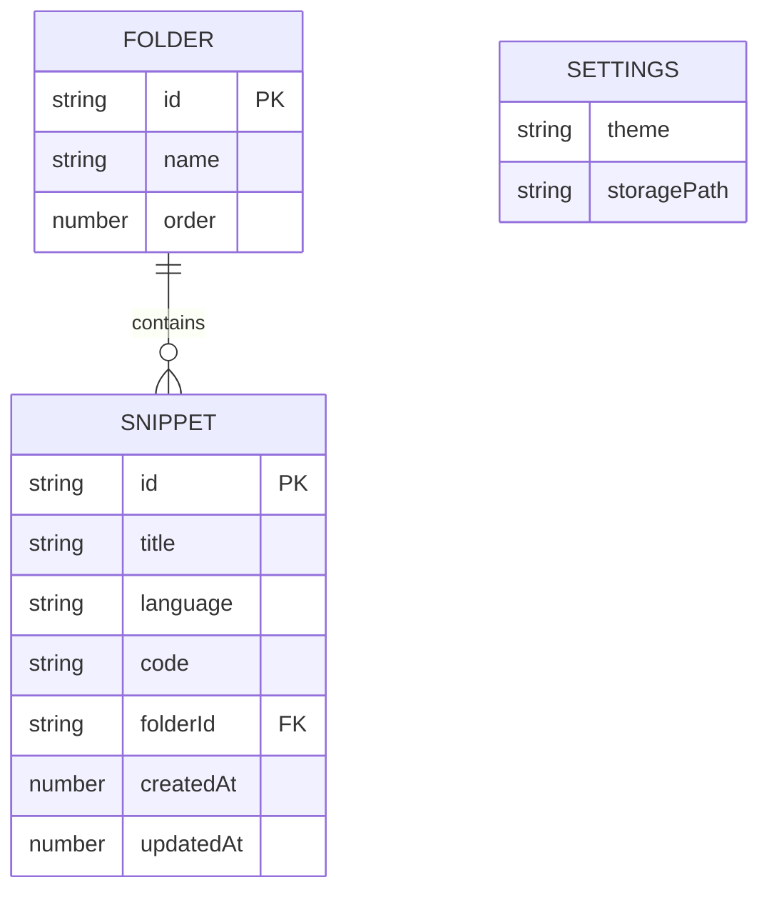
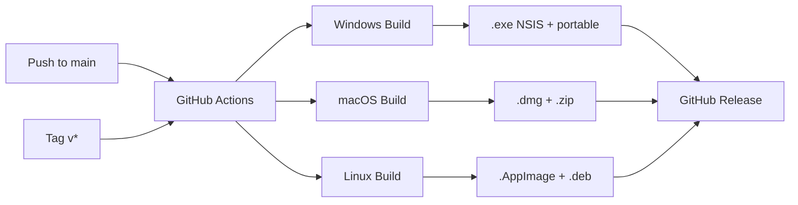

# High-Level Design (HLD) — Snippet Manager

## 1. Overview

Snippet Manager is a cross-platform desktop application for developers to store, organize, and drag-drop code snippets into external editors. Built with Electron, React, TypeScript, and CodeMirror.

## 2. System Architecture

```mermaid
  graph TB
    subgraph Electron Shell
        subgraph Main Process
end
end
end
```

```mermaid
graph TB
    subgraph Electron Shell
        subgraph Main Process
            M[main.cjs] --> S[store.cjs]
            M --> MN[menu.cjs]
            M --> I[ipc.cjs]
            S --> ES[(electron-store<br/>JSON on disk)]
        end
        subgraph Renderer Process
            R[React App] --> C[Components]
            R --> ST[Zustand Stores]
            R --> SV[Services]
            R --> H[Hooks]
        end
        P[preload.cjs] -.IPC Bridge.- Main Process
        P -.IPC Bridge.- Renderer Process
    end
```

## 3. Component Architecture



## 4. Data Flow



## 5. Layer Responsibilities

| Layer | Location | Responsibility |
|-------|----------|---------------|
| Types | `src/types/` | Interfaces: Snippet, Folder, Settings, Repository, Service |
| Constants | `src/constants.ts` | Layout dimensions, shared config |
| Data | `src/data/` | Default snippets (single source of truth) |
| Services | `src/services/` | Bridge (Adapter), Migration, Highlighter |
| Store | `src/store/` | State: snippetStore, settingsStore |
| Hooks | `src/hooks/` | useMenuEvents |
| Components | `src/components/` | UI: Sidebar, Editor, AddSnippetForm, CodeTooltip, LanguageSelect |
| Icons | `src/components/icons/` | Shared SVG icon components |
| Electron | `electron/` | main, store, menu, ipc, preload |

## 6. Design Patterns



### Applied Patterns
- **Adapter** — bridge.ts abstracts Electron IPC vs localStorage
- **Repository** — SnippetRepository, FolderRepository, SettingsRepository
- **Strategy** — Environment detection selects backend at startup
- **Facade** — main.cjs orchestrates focused modules
- **Factory** — cached() in languages.ts lazily creates LanguageSupport instances
- **Observer** — Menu events via webContents.send → useMenuEvents hook

## 7. SOLID Principles

| Principle | Application |
|-----------|-------------|
| **S** — Single Responsibility | Each module has one job: snippetStore (state), bridge (adaptation), migration (data migration), highlighter (preview), etc. |
| **O** — Open/Closed | Add a language: one line in languages.ts. Add an IPC channel: handler in ipc.cjs + method in bridge.ts. |
| **L** — Liskov Substitution | Electron and localStorage backends are interchangeable behind repository interfaces. |
| **I** — Interface Segregation | SnippetRepository, FolderRepository, SettingsRepository, WindowService, MenuService — each focused. |
| **D** — Dependency Inversion | Components depend on interfaces, not implementations. bridge.ts provides concrete backends. |

## 8. Window State Machine



## 9. Technology Stack

| Concern | Technology |
|---------|-----------|
| Desktop Shell | Electron 41 |
| UI Framework | React 19 |
| Language | TypeScript 6 |
| Bundler | Vite 8 |
| State Management | Zustand 5 |
| Code Editor | CodeMirror 6 |
| Persistence | electron-store / localStorage |
| IDs | uuid |
| CI/CD | GitHub Actions |
| Packaging | electron-builder |

## 10. Data Model



## 11. Security

- `contextIsolation: true` — Renderer cannot access Node.js APIs
- `nodeIntegration: false` — No Node.js in renderer
- Preload exposes only specific IPC channels via contextBridge
- No eval, no remote code execution, no dynamic requires

## 12. CI/CD


