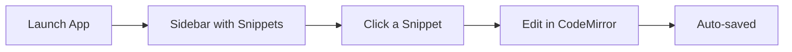
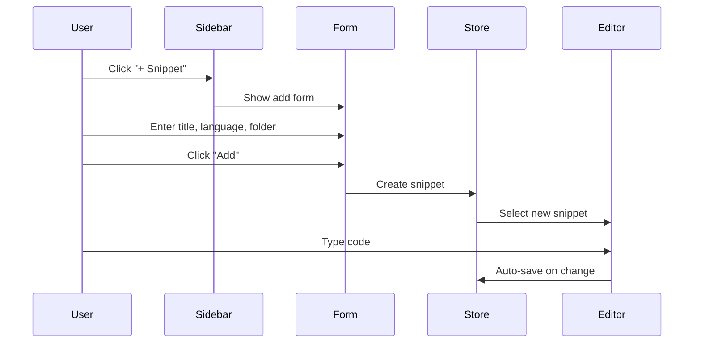
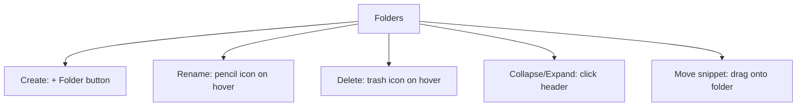
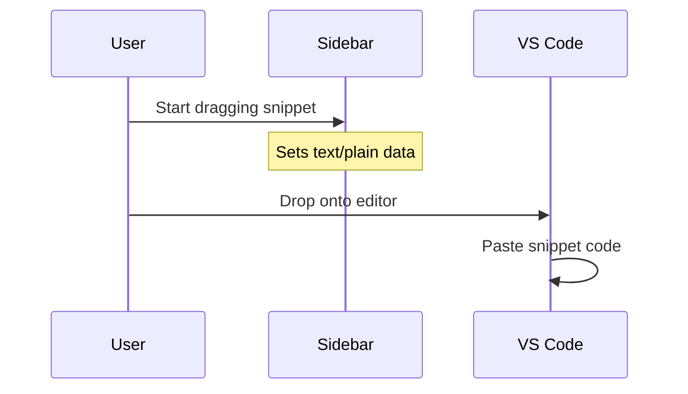
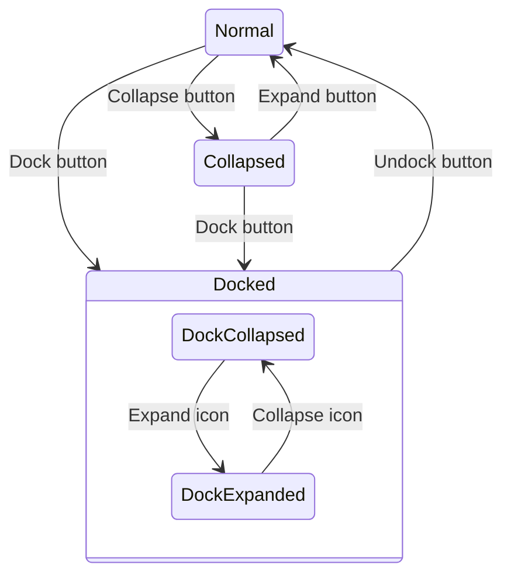

# User Guide — Snippet Manager

## Getting Started

After installing, launch the app. You'll see a sidebar with default snippets and a code editor.



## Interface Overview

```
┌──────────────────────────────────────────────┐
│  [Search snippets...]                        │
│  [+ Snippet] [+ Folder] [Collapse] [Dock]   │
├──────────────┬───────────────────────────────┤
│  📁 Folder   │  Title: [snippet name]  [JS]  │
│    </> Item  │                               │
│    </> Item  │  ┌───────────────────────┐    │
│  📁 Folder   │  │                       │    │
│  </> Item    │  │   CodeMirror Editor   │    │
│  </> Item    │  │                       │    │
│              │  └───────────────────────┘    │
└──────────────┴───────────────────────────────┘
     Sidebar          Editor Panel
```

## Creating Snippets

1. Click **+ Snippet** in the sidebar
2. Enter a title
3. Select a language (10 supported: C#, TypeScript, JavaScript, Java, Python, C++, SQL, Go, Rust, PHP)
4. Optionally select a folder
5. Click **Add**
6. Type your code in the editor — it auto-saves



## Organizing with Folders

### Create a Folder
1. Click **+ Folder**
2. Type a name, press Enter or click **Add**

### Move Snippets into Folders
- **Drag & drop**: Drag a snippet onto a folder header — it highlights blue when ready to drop
- **On creation**: Select a folder from the dropdown when adding a new snippet

### Folder Actions
- **Collapse/Expand**: Click the folder header (folder icon changes between open/closed)
- **Rename**: Hover over folder, click the pencil icon, type new name, press Enter
- **Delete**: Hover over folder, click the trash icon — snippets move to unfiled



## Reordering Snippets

Drag any snippet up or down in the list. A blue line shows where it will be placed. The order is saved automatically.

## Drag & Drop to External Editors

Drag any snippet from the sidebar directly into VS Code, Visual Studio, Notepad++, Sublime Text, or any text editor. The snippet code is dropped as plain text.



## Code Preview Tooltip

Hover over any snippet in the sidebar to see a preview tooltip showing the first 500 characters of the code.

## Search

Type in the search box to filter snippets by title or language. The filter applies across all folders.

## Window Modes



### Normal Mode
Full app with sidebar + editor. Resize the sidebar by dragging the border between sidebar and editor.

### Collapsed Mode (Sidebar Only)
Click **Collapse** — hides the editor, shrinks the window to show only the sidebar. Click **Expand** to restore.

### Dock Mode
Click **Dock** — pins the app to the right edge of the screen as a thin strip, always on top.

- **Dock Collapsed**: Icon-only strip with Undock, Expand, and Close buttons
- **Dock Expanded**: Full sidebar with search, folders, snippets — click Collapse to shrink back

## Theme

Toggle between dark and light theme:
- **Menu**: Settings → Toggle Theme
- **Keyboard**: `Ctrl+T` (or `Cmd+T` on macOS)

Theme is saved and persists across restarts.

## Custom Storage Location

By default, snippets are stored in the OS app data folder. To change:
1. Menu → Settings → Change Storage Location
2. Select a folder
3. Snippets are now read/written from that location

## Keyboard Shortcuts

| Shortcut | Action |
|----------|--------|
| `Ctrl+N` | New snippet |
| `Ctrl+T` | Toggle dark/light theme |

## Data Storage

| Platform | Default Location |
|----------|-----------------|
| Windows | `%APPDATA%/snippet-manager-electron-react/` |
| macOS | `~/Library/Application Support/snippet-manager-electron-react/` |
| Linux | `~/.config/snippet-manager-electron-react/` |

Files: `snippets.json` (snippets + folders), `settings.json` (theme + storage path)
